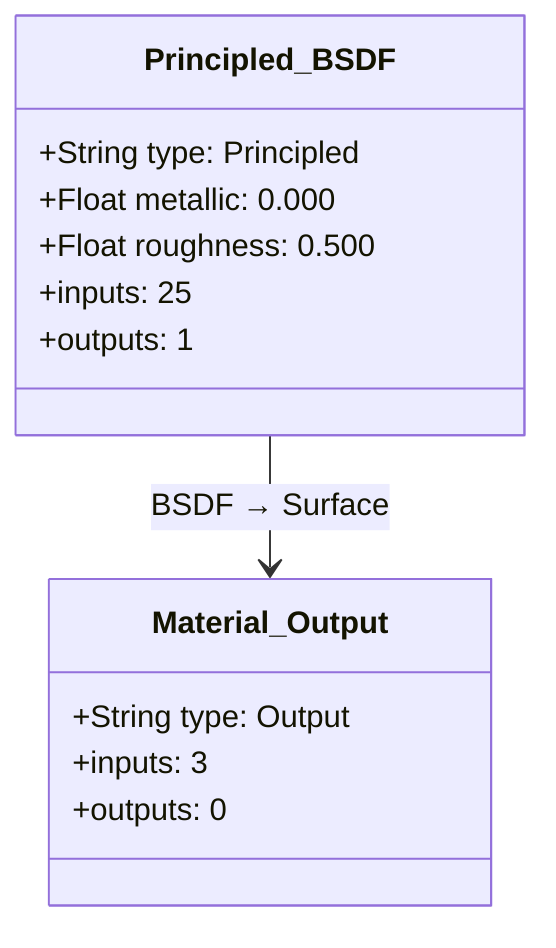
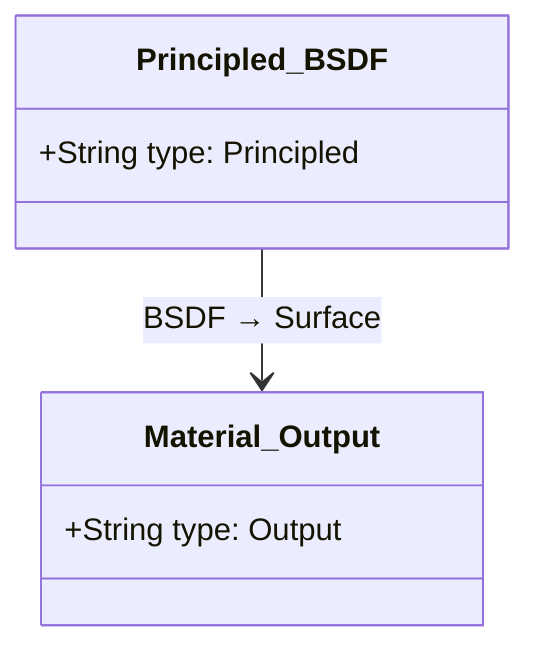
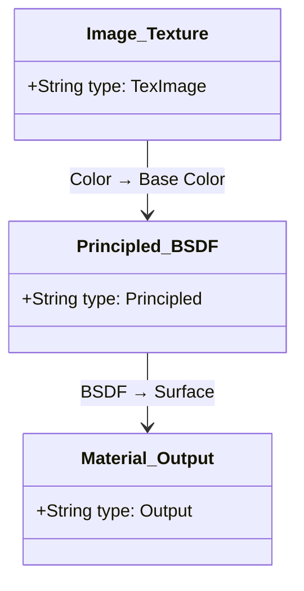
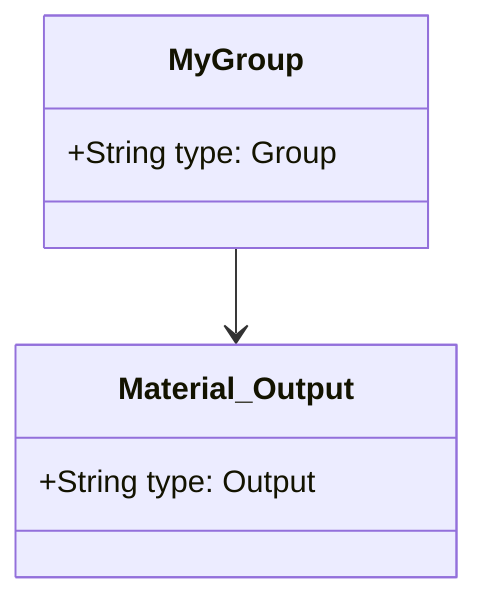
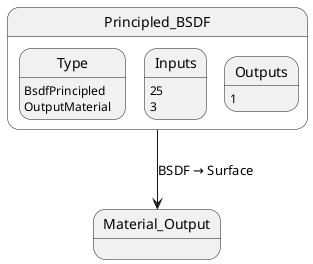
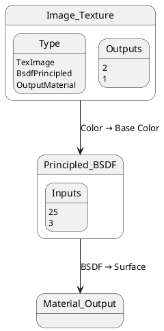

# Node to Diagram Converter

[](https://opensource.org/licenses/MIT)
[](https://www.blender.org/)

A Blender add-on that exports node trees to [Mermaid](https://mermaid.js.org/) or [PlantUML](https://plantuml.com/) diagram formats for easy sharing, documentation, and visualization.

## Features

- 🎨 **Export any node tree** to Mermaid class diagram or PlantUML state diagram format
- 🔀 **Multiple diagram formats**:
  - Mermaid class diagram format
  - PlantUML state diagram format
- 📊 **Automatic parameter inclusion** - Always exports complete parameter information for full documentation
- 🔄 **Supports all major node types**:
  - Shader Nodes
  - Compositor Nodes
  - Geometry Nodes
  - Texture Nodes
- 📦 **Handles nested node groups** with comments/notes
- 💾 **Export options**:
  - Save to `.mmd` file (Mermaid) or `.puml` file (PlantUML)
  - Print to console
  - Copy to clipboard (optional)
- 🚀 **Zero external dependencies** - pure `bpy` implementation
- 🎯 **Simple UI** integration in Node Editor sidebar

## Installation

### Method 1: Install from ZIP

1. Download this repository as a ZIP file
2. Open Blender (5.0 or later)
3. Go to `Edit` → `Preferences` → `Add-ons`
4. Click `Install...` button
5. Select the downloaded ZIP file
6. Enable the add-on by checking the box next to "Node: Node to Diagram Converter"

### Method 2: Manual Installation

1. Clone or download this repository
2. Copy the entire folder to your Blender addons directory:
   - **Windows**: `%APPDATA%\Blender Foundation\Blender\5.x\scripts\addons\`
   - **macOS**: `~/Library/Application Support/Blender/5.x/scripts/addons/`
   - **Linux**: `~/.config/blender/5.x/scripts/addons/`
3. Restart Blender
4. Enable the add-on in Preferences → Add-ons

## Usage

### Basic Export

1. Open any Node Editor (Shader Editor, Compositor, Geometry Nodes, etc.)
2. Create or open a node tree
3. Open the sidebar in the Node Editor (`N` key)
4. Navigate to the **Mermaid** tab
5. Click the **Export to Diagram** button
6. Configure export options in the dialog:
   - **Format**: Choose between Mermaid or PlantUML
   - ✅ **Save to File**: Saves `.mmd` file (Mermaid) or `.puml` file (PlantUML) next to your `.blend` file
   - ☐ **Copy to Clipboard**: Copies code to clipboard (requires `pyperclip`)
7. Click **OK** to export

### Export Options Explained

- **Format**: Choose the diagram format:
  - **Mermaid**: Exports as a Mermaid class diagram (`.mmd` file)
  - **PlantUML**: Exports as a PlantUML state diagram (`.puml` file)
- **Save to File**: Exports the diagram to a file in the same directory as your `.blend` file
- **Copy to Clipboard**: Copies the diagram code to your system clipboard for quick pasting

Node parameters are always included in the export to ensure complete documentation.

### Output Example

The add-on exports nodes as a Mermaid class diagram, showing each node with its properties in a structured way:



### Viewing Mermaid Diagrams

You can view the generated Mermaid diagrams using:

- [Mermaid Live Editor](https://mermaid.live/) - Paste your code and see the diagram
- GitHub/GitLab - Markdown files with Mermaid code blocks are automatically rendered
- VS Code - With Mermaid extensions
- Documentation tools - Many support Mermaid (MkDocs, Docusaurus, etc.)

## Examples

### Simple Shader Network



### With Texture Nodes



### Nested Groups

The add-on automatically handles node groups with comment annotations:



### PlantUML State Diagram Examples

When exporting to PlantUML format, nodes are represented as states with transitions.

#### Simple Shader Network (PlantUML)



#### With Texture Nodes (PlantUML)



### Viewing PlantUML Diagrams

You can view the generated PlantUML diagrams using:

- [PlantUML Online Server](http://www.plantuml.com/plantuml/) - Paste your code and see the diagram
- [PlantUML Web Server](https://www.planttext.com/) - Another online viewer
- VS Code - With PlantUML extensions
- IntelliJ IDEA / PyCharm - Built-in PlantUML support
- Command line - Using PlantUML jar file
- Documentation tools - Many support PlantUML integration

## Technical Details

### Supported Node Trees

- `ShaderNodeTree` - Material shading nodes
- `CompositorNodeTree` - Compositing nodes  
- `GeometryNodeTree` - Geometry manipulation nodes
- `TextureNodeTree` - Texture nodes

### How It Works

1. **Traverses** the active node tree in the Node Editor
2. **Extracts** node information (name, type, sockets, parameters)
3. **Maps** connections between nodes via links
4. **Generates** diagram syntax based on selected format:
   - **Mermaid**: `classDiagram` format with nodes as classes
   - **PlantUML**: State diagram format with nodes as states
5. **Handles** nested node groups with comments/notes
6. **Sanitizes** node names for valid diagram identifiers

### File Output

- **Default location**: Same directory as your `.blend` file
- **Filename**: `node_tree.mmd` (Mermaid) or `node_tree.puml` (PlantUML)
- **Fallback**: System temp directory if `.blend` file is not saved
- **Format**: Plain text diagram code

## Requirements

- **Blender**: 5.0 or later
- **Python**: Built-in with Blender (no external dependencies)
- **Optional**: `pyperclip` library for clipboard support (not required)

## Limitations

- Very complex node trees may produce large diagrams
- Node positioning from Blender is not preserved in Mermaid
- Some specialized node types may have generic labels

## Development

### Project Structure

```
blender-nodes-to-mermaid/
├── __init__.py          # Main add-on code
├── README.md            # This file
├── LICENSE              # MIT License
└── .gitignore          # Git ignore rules
```

### Code Overview

- `build_class_diagram()`: Converts node tree to Mermaid class diagram syntax
- `build_plantuml_state_diagram()`: Converts node tree to PlantUML state diagram syntax
- `NODE_OT_export_to_mermaid`: Operator for export functionality with format selection
- `NODE_PT_mermaid_panel`: UI panel in Node Editor sidebar

## Contributing

Contributions are welcome! Please feel free to submit issues or pull requests.

### Future Improvements

- [ ] Add node positioning hints for better layouts
- [ ] Support custom node colors/styles
- [ ] Export multiple node trees at once
- [ ] Add preferences panel for default export settings
- [ ] Support for custom node tree types
- [ ] Automated tests for different node configurations
- [ ] Better handling of complex nested groups
- [ ] Export to other diagram formats

## License

This project is licensed under the MIT License - see the [LICENSE](LICENSE) file for details.

## Acknowledgments

- Built for the Blender community
- Uses [Mermaid](https://mermaid.js.org/) diagram syntax
- Inspired by the need to document complex node setups

## Support

If you encounter any issues or have questions:

1. Check existing [Issues](https://github.com/fiord/blender-nodes-to-mermaid/issues)
2. Create a new issue with:
   - Blender version
   - Node tree type
   - Steps to reproduce
   - Error messages (check Blender console)

---

**Made with ❤️ for the Blender community**
