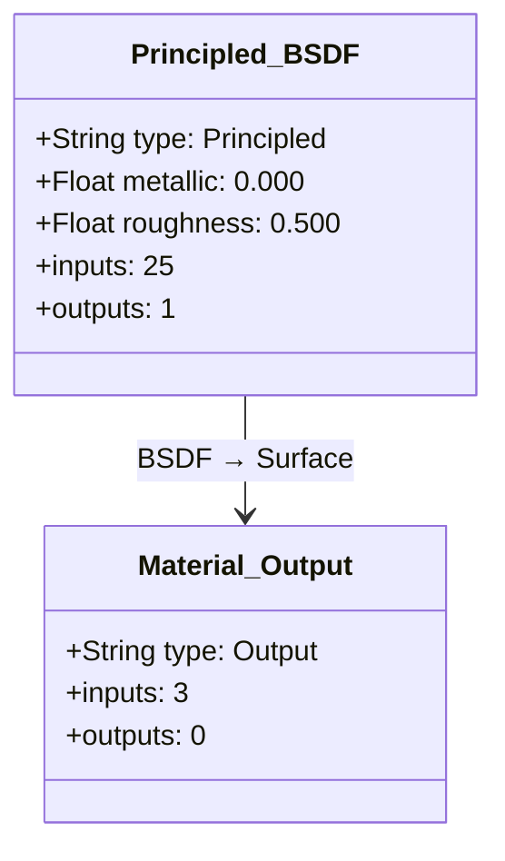
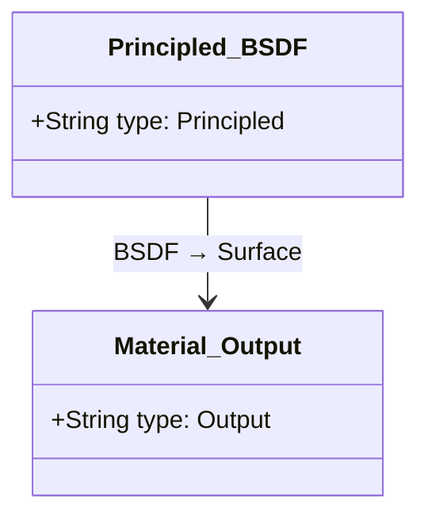
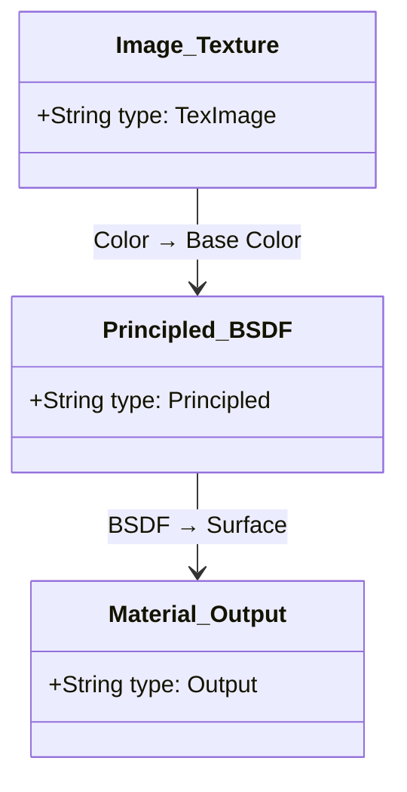
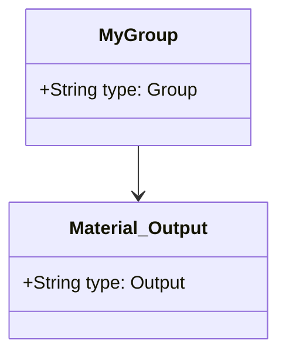

# Node to Mermaid Converter

[](https://opensource.org/licenses/MIT)
[](https://www.blender.org/)

Blenderのノードツリーを[Mermaid](https://mermaid.js.org/)ダイアグラム形式でエクスポートし、簡単に共有、ドキュメント化、可視化するためのアドオンです。

## 機能

- 🎨 **任意のノードツリー**をMermaidクラス図形式でエクスポート
- 📊 **ノードパラメータを含める** - 完全なドキュメント化のためにパラメータ情報を含めてエクスポート
- 🔄 **主要なノードタイプをすべてサポート**:
  - シェーダーノード
  - コンポジターノード
  - ジオメトリノード
  - テクスチャノード
- 📦 **ネストされたノードグループ**をコメントで処理
- 💾 **複数のエクスポートオプション**:
  - `.mmd`ファイルとして保存
  - コンソールに出力
  - クリップボードにコピー（オプション）
  - パラメータ含有の切り替え
- 🚀 **外部依存なし** - 純粋な`bpy`実装
- 🎯 **シンプルなUI** - ノードエディターのサイドバーに統合

## インストール

### 方法1: ZIPファイルからインストール

1. このリポジトリをZIPファイルとしてダウンロード
2. Blender（バージョン5.0以降）を開く
3. `編集` → `プリファレンス` → `アドオン`に移動
4. `インストール...`ボタンをクリック
5. ダウンロードしたZIPファイルを選択
6. "Node: Node to Mermaid Converter"の横のチェックボックスをオンにしてアドオンを有効化

### 方法2: 手動インストール

1. このリポジトリをクローンまたはダウンロード
2. フォルダ全体をBlenderのアドオンディレクトリにコピー:
   - **Windows**: `%APPDATA%\Blender Foundation\Blender\5.x\scripts\addons\`
   - **macOS**: `~/Library/Application Support/Blender/5.x/scripts/addons/`
   - **Linux**: `~/.config/blender/5.x/scripts/addons/`
3. Blenderを再起動
4. プリファレンス → アドオンでアドオンを有効化

## 使い方

### 基本的なエクスポート

1. 任意のノードエディター（シェーダーエディター、コンポジター、ジオメトリノードなど）を開く
2. ノードツリーを作成または開く
3. ノードエディターのサイドバーを開く（`N`キー）
4. **Mermaid**タブに移動
5. **Export to Mermaid**ボタンをクリック
6. ダイアログでエクスポートオプションを設定:
   - ✅ **Include Node Parameters**: ノードのパラメータと値を含めて完全なドキュメントを作成（共有時に推奨）
   - ✅ **Save to File**: `.blend`ファイルの隣に`.mmd`ファイルを保存
   - ☐ **Copy to Clipboard**: コードをクリップボードにコピー（`pyperclip`が必要）
7. **OK**をクリックしてエクスポート

### エクスポートオプションの説明

- **Include Node Parameters**: 有効にすると、ノードの設定を再現するために必要なすべての重要なパラメータ（値、設定、色など）をエクスポートします。他のユーザーと完全なノードグラフを共有する際に必須です。
- **Save to File**: `.blend`ファイルと同じディレクトリに`.mmd`ファイルとしてダイアグラムをエクスポートします
- **Copy to Clipboard**: Mermaidコードをシステムのクリップボードにコピーして、すぐに貼り付けられるようにします

### 出力例

アドオンは、各ノードをプロパティと共に構造化された方法で表示するMermaidクラス図としてエクスポートします:



### Mermaidダイアグラムの表示

生成されたMermaidダイアグラムは以下の方法で表示できます:

- [Mermaid Live Editor](https://mermaid.live/) - コードを貼り付けてダイアグラムを表示
- GitHub/GitLab - Mermaidコードブロックを含むMarkdownファイルは自動的にレンダリングされます
- VS Code - Mermaid拡張機能を使用
- ドキュメントツール - 多くのツールがMermaidをサポート（MkDocs、Docusaurusなど）

## 例

### シンプルなシェーダーネットワーク



### テクスチャノードを含む例



### ネストされたグループ

アドオンはコメント注釈でノードグループを自動的に処理します:



## 技術詳細

### サポートされるノードツリー

- `ShaderNodeTree` - マテリアルシェーディングノード
- `CompositorNodeTree` - コンポジティングノード
- `GeometryNodeTree` - ジオメトリ操作ノード
- `TextureNodeTree` - テクスチャノード

### 仕組み

1. **トラバース** - ノードエディター内のアクティブなノードツリーを走査
2. **抽出** - ノード情報（名前、タイプ、ソケット）を抽出
3. **マッピング** - リンクを介してノード間の接続をマッピング
4. **生成** - `classDiagram`形式のMermaid構文を生成
5. **処理** - ネストされたノードグループをコメントで処理
6. **サニタイズ** - 有効なMermaidクラス名のためにノード名をサニタイズ

### ファイル出力

- **デフォルトの場所**: `.blend`ファイルと同じディレクトリ
- **ファイル名**: `node_tree.mmd`
- **フォールバック**: `.blend`ファイルが保存されていない場合はシステムの一時ディレクトリ
- **形式**: プレーンテキストのMermaidダイアグラムコード

## 要件

- **Blender**: バージョン5.0以降
- **Python**: Blenderに組み込み（外部依存なし）
- **オプション**: クリップボードサポート用の`pyperclip`ライブラリ（必須ではありません）

## 制限事項

- 非常に複雑なノードツリーは大きなダイアグラムを生成する可能性があります
- Blenderからのノードの位置情報はMermaidでは保持されません
- 一部の特殊なノードタイプは一般的なラベルを持つ場合があります

## 開発

### プロジェクト構造

```
blender-nodes-to-mermaid/
├── __init__.py          # メインアドオンコード
├── README.md            # このファイル（英語版）
├── README_ja.md         # このファイル（日本語版）
├── LICENSE              # MITライセンス
└── .gitignore          # Git無視ルール
```

### コード概要

- `build_mermaid()`: ノードツリーをMermaid構文に再帰的に変換
- `NODE_OT_export_to_mermaid`: エクスポート機能のためのオペレーター
- `NODE_PT_mermaid_panel`: ノードエディターサイドバーのUIパネル

## 貢献

貢献を歓迎します！issueやpull requestを自由に送信してください。

### 今後の改善

- [ ] より良いレイアウトのためのノード位置ヒントを追加
- [ ] カスタムノードの色/スタイルをサポート
- [ ] 複数のノードツリーを一度にエクスポート
- [ ] デフォルトのエクスポート設定用のプリファレンスパネルを追加
- [ ] カスタムノードツリータイプをサポート
- [ ] 異なるノード構成の自動テスト
- [ ] 複雑なネストされたグループのより良い処理
- [ ] 他のダイアグラム形式へのエクスポート

## ライセンス

このプロジェクトはMITライセンスの下でライセンスされています - 詳細は[LICENSE](LICENSE)ファイルを参照してください。

## 謝辞

- Blenderコミュニティのために構築
- [Mermaid](https://mermaid.js.org/)ダイアグラム構文を使用
- 複雑なノード設定をドキュメント化する必要性に触発されました

## サポート

問題が発生した場合や質問がある場合:

1. 既存の[Issues](https://github.com/fiord/blender-nodes-to-mermaid/issues)を確認
2. 以下の情報を含む新しいissueを作成:
   - Blenderのバージョン
   - ノードツリーのタイプ
   - 再現手順
   - エラーメッセージ（Blenderコンソールを確認）

---

**Blenderコミュニティのために❤️を込めて作成**
